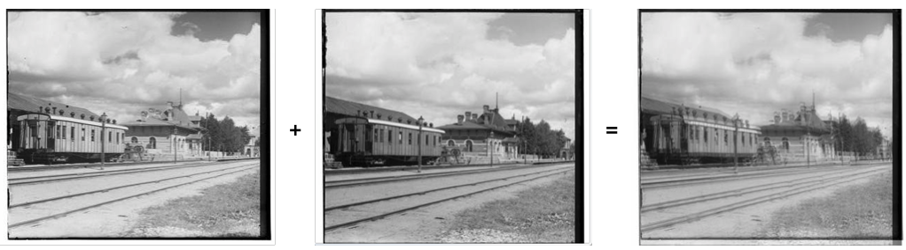
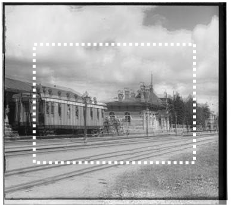

1.把照片分成三份然后对齐，上色

量化，直线检测

首先计算出图像的锐度二值化图像，然后检测图中直线的位置


整体对比度越高，说明对的越齐

2.剪切，降噪，锐化，大光圈


在艰苦卓绝的尝试了一天之后，终于可以让大部分图片显示出正常的彩色了。

按照老师提供的思路，第一步是在一个范围内搜索匹配


### Project 1: Image Alignment and Color Compositing

Description: [http://robertpless.com/classes/ComputerVision/project1/description.html](https://www.gitbook.com/book/zhengxiangyue/computervision/edit#)

Advisor: [Robert Pless](https://www.gitbook.com/book/zhengxiangyue/computervision/edit#)

Source code:

## Problem Analysis:

The problem are divided into two parts:

1. Given three slightly mutually shifted grayscale images(RGB), align them so the final image is clear.
   1. If using a brutal force search, the only question is **how to quantify "the clearness of an image"**
   2. The second approach that I can think of is to find "the same point in real world" of each image, since in this problem all pixels only shift equally.
2. Adjust the image so it looks better 1. Thanks to the "not too much" photography experience, I think its really about how to adjust the picture to **make the three-channel's histogram looks good** since we could directly and generally judge an image by looking at its histogram without looking at the image. Those include sharpness, contrast and so on

## Step 1: Single scale implement of brutal search

#### Overlap images:

Thanks to the sample code, we now have 3 equal-size grayscale images representing three colour channels. To overlap them, operate two images each time and **let new pixel's value be equal to half of the sum of the values of the corresponding pixels of the two pictures**, I'm not sure if it looks what I'm expecting, so let's try it.



(R + G)

Yes, it looks the image should be. The next procedure is to calculate the image's "clearness". I don't want to use the word "sharpness" because I think this kind of "unclearness" is a little different from "traditional blurriness", the way we quantify "sharpness" may not satisfy here. It's more like a "Motion blurriness". But whatever, try it.

#### Quantifying the sharpness of an image:

Several quantification method will be tried:

1. Brenner Gradient Method, which calculate the difference between a pixel's value with the previous of the previous pixel, and add all abs(difference). the bigger the sum is, the higher contrast the image has, the sharper the image is.
2. Method 2
3. Method 3

Before calculating the sharpness, there are several parameters to be decided.

1. The first parameter is the **search range**, let's set it as recommanded [-15,15] for both x and y coordinates in the.

2. May be running the specific method on the whole image is not necessary since the "bluriness" of an smaller sub-image is corespondent to the whole image

   |  |
   | :--------------------------------------: |
   |                                          |

Let's set the window to be the middle half of the image, that is, x starts from 1/4 position and ends at 3/4 position, as well as y. It also prevent the influence by the image boundary where the pixels are invalid information.

Let's try the methods mentioned above and see if the perfect overlapped image could be chosen.

1. Brenner Gradient Method

   ```matlab
   % R, G, B are the three grayscale images, each pixel range from 0 - 255
   maxValue = 0;
   score(1:30,1:30) = 0;

   ```

   ​